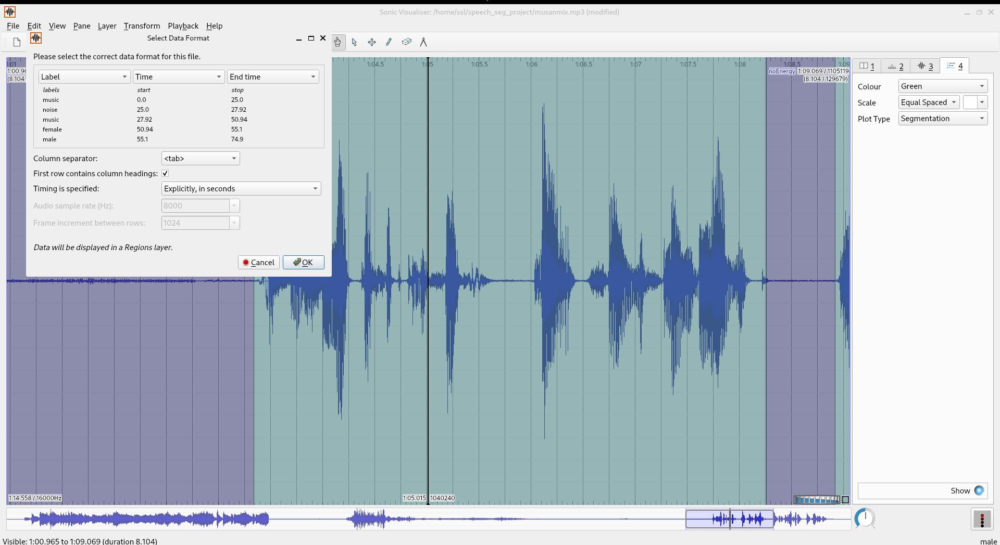
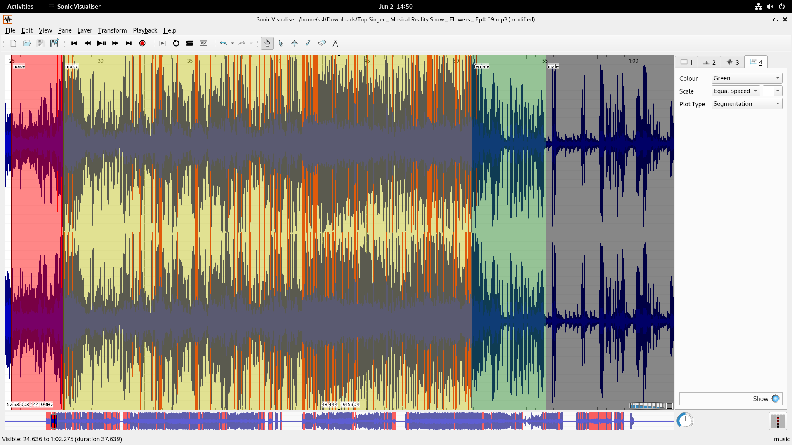

#  Audio Segmentation with inaSpeechSegmenter

This guide walks you through using the [inaSpeechSegmenter](https://github.com/ina-foss/inaSpeechSegmenter) tool for segmenting an audio file into speech, music, and noise sections.

---

## Set Up Your Environment
Before running segmentation, ensure your Anaconda environment is set up.
```bash
conda create --name speech_seg python=3.8 -y
conda activate speech_seg
```
Install the required dependencies:
```bash
conda install -c conda-forge numpy scipy matplotlib ffmpeg requests -y
pip install torch tensorflow inaSpeechSegmenter
```
---

## Navigate to Your Audio File Directory
Change directory to where your MP3 file and inaSpeechSegmenter.py file is stored:
```bash
cd /home/ssl/Downloads/
```

---

---
## Segment the Audio Using inaSpeechSegmenter

```bash
python inaSpeechSegmenter.py -i "/home/ssl/Downloads/Top Singer _ Musical Reality Show _ Flowers _ Ep# 09.mp3" -o ~/ina_output
```

here,

Inputs: the mp3 file.

Outputs: the segmentation results into ~/ina_output/.

If mp3 file doesn't work then convert it into wav. Since inaSpeechSegmenter works best with WAV files
```bash
ffmpeg -i "Top Singer _ Musical Reality Show _ Flowers _ Ep# 09.mp3" "top_singer.wav"
```
---

---

## Open the CSV to Check Labels

```bash
cat ~/speech_seg_project/top_singer.csv

```

---

## Import Labels into Sonic Visualiser
If Sonic Visualiser is installed, run:

```bash
sonic-visualiser


```
## In Sonic Visualiser:

File -> Open -> select top_singer.wav

Layer -> Import Annotation Layer -> From CSV File -> select top_singer.csv

Make heading of first column as label - second column as time -and third column as- end time

Tick-first row contains column heading

Time is specified explicitly in seconds->ok

## On the right pane

Colour:Green

Scale: Equally spaced

Plot type: segmentation



 image_url https://github.com/geethikavivek21/Music-information-Retrieval/blob/5a37f4b7352c7cb6feba18f5bd7d56208d70f4ce/Screenshot%20from%202025-05-30%2017-17-30.png



You’ll see labeled segments aligned with the waveform.


## Optional: Install Sonic Visualiser
If not already installed:

```bash
sudo apt update
sudo apt install sonic-visualiser -y


```

---
